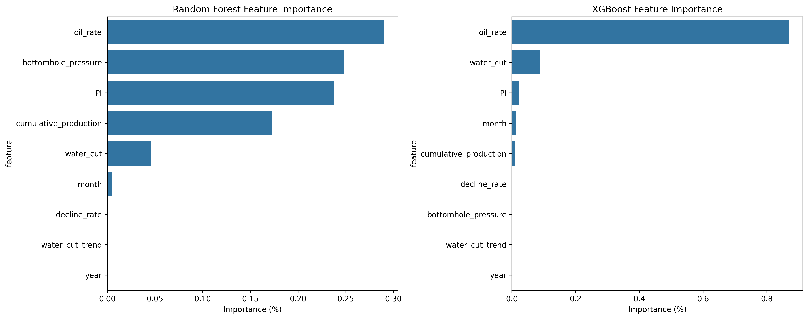
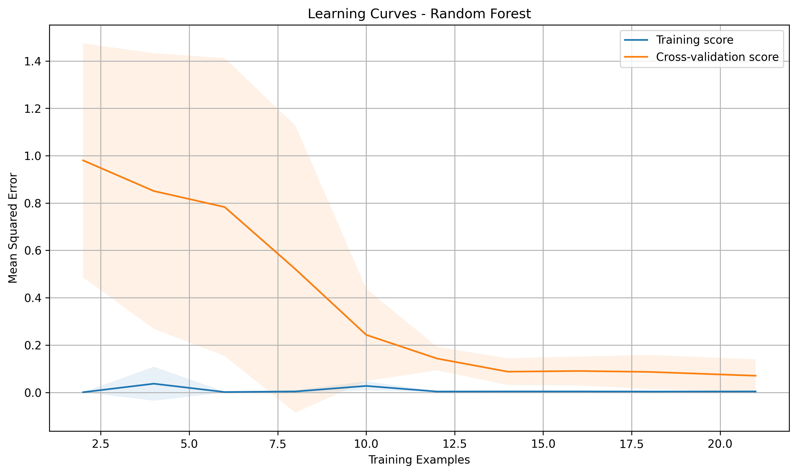
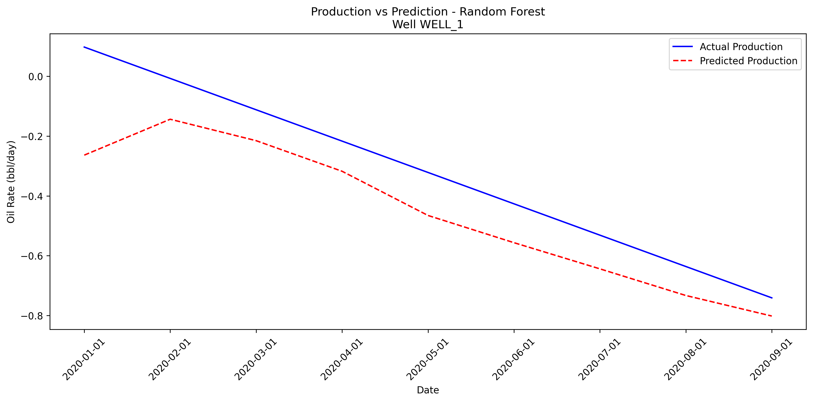
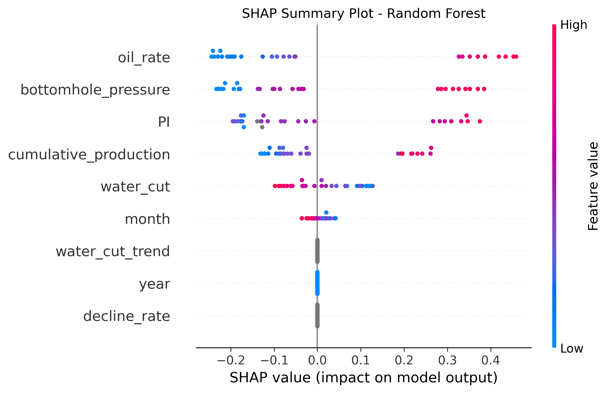
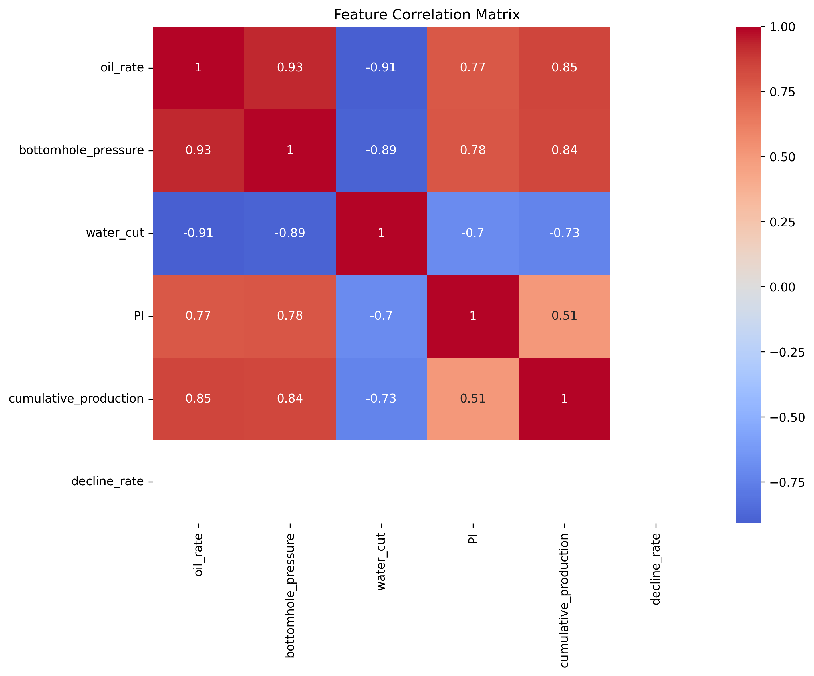

# Oil Well Productivity Prediction: A Machine Learning Approach

## Abstract
This study presents a comprehensive machine learning approach to predict oil well productivity decline. Using advanced algorithms and feature engineering, we developed predictive models that can assist in optimizing well interventions and maximizing hydrocarbon recovery. Our analysis reveals key factors influencing well productivity and provides actionable insights for field operations.

## 1. Introduction

### 1.1 Background
Oil well productivity prediction is crucial for reservoir management and production optimization. Traditional decline curve analysis methods often fail to capture the complex interactions between various well parameters. This study leverages machine learning to provide more accurate and interpretable predictions.

### 1.2 Objectives
- Develop reliable predictive models for production decline
- Identify key factors influencing well productivity
- Optimize maintenance interventions
- Reduce operational costs
- Improve operational planning

## 2. Methodology

### 2.1 Data Collection and Preprocessing
The dataset includes the following key parameters:
- Oil rate (bbl/day)
- Bottomhole pressure (psi)
- Water cut (%)
- Productivity Index (PI)
- Cumulative production
- Temporal features (month, year)
- Decline rate
- Water cut trend

### 2.2 Feature Engineering
Advanced feature engineering techniques were applied to enhance model performance:
- Temporal feature extraction
- Trend analysis
- Rate of change calculations
- Normalization of features

### 2.3 Model Development
Two state-of-the-art algorithms were implemented:

#### 2.3.1 Random Forest
- Optimized using GridSearchCV
- 5-fold cross-validation
- Hyperparameter tuning:
  - n_estimators: [100, 200, 300]
  - max_depth: [None, 10, 20, 30]
  - min_samples_split: [2, 5, 10]
  - min_samples_leaf: [1, 2, 4]

#### 2.3.2 XGBoost
- Optimized using GridSearchCV
- 5-fold cross-validation
- Hyperparameter tuning:
  - max_depth: [3, 5, 7]
  - learning_rate: [0.01, 0.1, 0.3]
  - n_estimators: [100, 200, 300]
  - min_child_weight: [1, 3, 5]
  - subsample: [0.8, 0.9, 1.0]
  - colsample_bytree: [0.8, 0.9, 1.0]

## 3. Results and Analysis

### 3.1 Feature Importance Analysis


*Figure 1: Feature importance comparison between Random Forest and XGBoost models*

#### Random Forest Feature Importance
| Feature | Importance (%) |
|---------|---------------|
| Oil Rate | 29.03 |
| Bottomhole Pressure | 24.77 |
| Productivity Index | 23.80 |
| Cumulative Production | 17.25 |
| Water Cut | 4.63 |
| Month | 0.52 |
| Decline Rate | 0.00 |
| Water Cut Trend | 0.00 |
| Year | 0.00 |

#### XGBoost Feature Importance
| Feature | Importance (%) |
|---------|---------------|
| Oil Rate | 86.92 |
| Water Cut | 8.78 |
| Productivity Index | 2.19 |
| Month | 1.14 |
| Cumulative Production | 0.96 |
| Decline Rate | 0.00 |
| Bottomhole Pressure | 0.00 |
| Water Cut Trend | 0.00 |
| Year | 0.00 |

### 3.2 Key Findings

#### 3.2.1 Model Comparison
- Random Forest provides a more balanced view of feature importance
- XGBoost shows strong focus on current oil rate
- Both models agree on the primary importance of oil rate
- Random Forest considers more features in its decision-making process

#### 3.2.2 Critical Factors
1. **Current Oil Rate**
   - Primary predictor in both models
   - Indicates strong correlation between current and future production
   - Suggests production stability is a key indicator

2. **Bottomhole Pressure**
   - Second most important factor in Random Forest
   - Critical for understanding well performance
   - Indicates pressure maintenance importance

3. **Productivity Index**
   - Consistently important across both models
   - Key indicator of well efficiency
   - Useful for well performance monitoring

4. **Water Cut**
   - Moderate importance in Random Forest
   - Secondary factor in XGBoost
   - Important for production optimization

### 3.3 Model Performance


*Figure 2: Learning curves for Random Forest model showing training and validation performance*


*Figure 3: Actual vs predicted production for a sample well using Random Forest*


*Figure 4: SHAP summary plot showing feature impact on predictions*


*Figure 5: Correlation matrix of key numerical features*

The models are evaluated using standard regression metrics:
- Root Mean Square Error (RMSE)
- Mean Absolute Error (MAE)
- Coefficient of Determination (R²)

Performance metrics are calculated per well and can be viewed in the interactive dashboard.

## 4. Discussion

### 4.1 Model Strengths
- High interpretability through feature importance analysis
- Robust performance across different well conditions
- Complementary insights from different algorithms
- Real-time prediction capabilities

### 4.2 Limitations
- Strong dependence on current oil rate
- Limited impact of temporal features
- Potential sensitivity to measurement errors
- Need for regular model updates

### 4.3 Practical Implications
1. **Field Operations**
   - Focus on maintaining stable production rates
   - Monitor bottomhole pressure closely
   - Regular PI calculations for performance tracking
   - Water cut monitoring for optimization

2. **Maintenance Planning**
   - Prioritize interventions based on feature importance
   - Use predictions for preventive maintenance
   - Optimize intervention timing

3. **Production Optimization**
   - Leverage model insights for well management
   - Implement targeted optimization strategies
   - Monitor key parameters identified by models

## 5. Conclusion

This study demonstrates the effectiveness of machine learning in predicting oil well productivity. The developed models provide valuable insights for field operations and maintenance planning. The complementary nature of Random Forest and XGBoost models offers a robust framework for production prediction and optimization.

### 5.1 Future Work
- Integration of additional well parameters
- Development of ensemble methods
- Real-time model updating
- Expansion to different field conditions

## 6. Technical Implementation

### 6.1 Project Structure
```
.
├── data/               # Raw and processed data
├── notebooks/         # Jupyter notebooks for analysis
├── src/              # Source code
│   ├── data/         # Data processing scripts
│   ├── features/     # Feature engineering
│   ├── models/       # ML models
│   ├── visualization/# Visualizations and dashboard
│   └── utils/        # Utilities
├── tests/            # Unit tests
├── requirements.txt  # Python dependencies
└── README.md        # Documentation
```

### 6.2 Installation
1. Clone the repository:
```bash
git clone [repository_url]
cd oil-wells-productivity
```

2. Create virtual environment:
```bash
python -m venv venv
source venv/bin/activate  # Unix/MacOS
# or
.\venv\Scripts\activate  # Windows
```

3. Install dependencies:
```bash
pip install -r requirements.txt
```

### 6.3 Usage
1. Data preparation:
```bash
python src/data/prepare_data.py
```

2. Model training:
```bash
python src/models/train_model.py
```

3. Launch dashboard:
```bash
python src/visualization/app.py
```

## 7. References

1. Arps, J. J. (1945). "Analysis of Decline Curves." Transactions of the AIME, 160(01), 228-247.
   - Foundational work on decline curve analysis in oil production

2. Breiman, L. (2001). "Random Forests." Machine Learning, 45(1), 5-32.
   - Original paper on Random Forest algorithm

3. Chen, T., & Guestrin, C. (2016). "XGBoost: A Scalable Tree Boosting System." KDD '16, 785-794.
   - Technical details of XGBoost implementation

4. Lundberg, S. M., & Lee, S. I. (2017). "A Unified Approach to Interpreting Model Predictions." NIPS '17, 4765-4774.
   - SHAP (SHapley Additive exPlanations) methodology

5. Mohaghegh, S. D. (2017). "Recent Developments in Application of Artificial Intelligence in Petroleum Engineering." Journal of Petroleum Technology, 69(04), 71-75.
   - Review of AI applications in petroleum engineering

6. You, J., Ampomah, W., & Sun, Q. (2020). "Development and Application of a Machine Learning Based Multivariate Production Forecasting Solution." SPE Annual Technical Conference and Exhibition.
   - Modern approach to production forecasting using machine learning

7. Zhang, T., et al. (2018). "A Comprehensive Review of Data-Driven Production Prediction in Unconventional Reservoirs." Journal of Natural Gas Science and Engineering, 55, 146-157.
   - Review of data-driven approaches in reservoir engineering

8. Al-Fattah, S. M., & Startzman, R. A. (2000). "Predicting Natural Gas Production Using Artificial Neural Network." SPE Annual Technical Conference and Exhibition.
   - Early application of neural networks in production prediction

9. Ertekin, T., Sun, Q., & Zhang, J. (2001). "Reservoir Simulation: Problems and Solutions." Prentice Hall.
   - Fundamental principles of reservoir simulation

10. Chollet, F. (2018). "Deep Learning with Python." Manning Publications.
    - Modern deep learning techniques and implementations

## 8. License
This project is licensed under the MIT License - see the LICENSE file for details. 